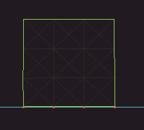
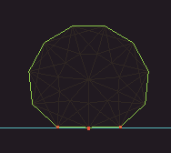

\page getting_started Getting Started


## Creating a World
In QuarkPhysics, there is a \ref QWorld object that manages all objects and ensures the continuation of all physics steps. You must first create a world. You can also configure this world and set its properties.


```cpp
//Create a world
QWorld *world=new QWorld(); 
// Set the gravity value
world->SetGravity(QVector(0.0f,0.2f) ); 
//Set the iteration count per step of physics in the world.
world->SetIterationCount(4); 

```

To update a physics step, you simply need to use the \ref QWorld::Update method.

```cpp

world->Update(); // Updates the physics simulation of the world as a step.

```

For more information you can refer to the \ref QWorld class documentation.

## Creating a Rigid Body
To create a rigid body for our physics world, we need to create a \ref QRigidBody object, which inherits from the \ref QBody class. Additionally, to give the rigid body shape, we need to create a \ref QMesh object and attach it to the body. Finally, we add the created \ref QRigidBody object to our physics world using the \ref QWorld::AddBody method.


```cpp
//Create a Rigid Body
QRigidBody *body=new QRigidBody();
// Create a Mesh  
QMesh * rectMesh=QMesh::CreateWithRect(QVector(rectWidth,rectHeight),QVector(centerPosX,centerPosY));
// Add the Mesh to the Rigid Body
body->AddMesh(rectMesh); 
//Set the Body Position
body->SetPosition(QVector(posX,posY) );
//Set the Body Rotation
body->SetRotation( radAngle ); // or body->SetRotationDegree(degreeAngle)
//Add the Rigid Body to the World
world->AddBody(body);

```


## Creating a Soft Body
Just like with rigid bodies, to create a soft body, we need to create a \ref QSoftBody object. Then, we need to create a QMesh that defines the shape of our soft body and add it to the QSoftBody object. Finally, we add our new soft body to the physics world, i.e., QWorld.

```cpp
//Create a Soft Body
QRigidBody *body=new QSoftBody();
// Create a Mesh  
QMesh * polygonMesh=QMesh::CreateWithPolygon(radius,sideCount,QVector(centerPosX,centerPosY)));
// Add the Mesh to the Soft Body
body->AddMesh(rectMesh); 
//Set the Body Position
body->SetPosition(QVector(posX,posY) );
//Set the Body Rotation
body->SetRotation( radAngle ); // or body->SetRotationDegree(degreeAngle)
//Add the Soft Body to the World
world->AddBody(body);

```

### Addinational QMesh features for Soft Bodies 
For rigid body objects, only particles and the outer edges connecting them are sufficient. However, for soft body structures, you need additional internal particles and spring connections. In the QMesh class, while creating primitive shapes such as quads or regular polygons, you can form grid networks with spring connections inside these shapes. This explains why the class is named 'mesh' instead of a more conventional 'shape'-derived name.




```cpp
int gridColumnCount=3;
int gridRowCount=3;
//Create a Gridded Rectangle Mesh
QMesh * griddedRectMesh=QMesh::CreateWithRect( QVector(width,height),QVector(centerX,centerY),QVector(gridRowCount,gridRowCount) );
//Add the Mesh to the Soft Body
mySoftBody->AddMesh(griddedRectMesh);

```



```cpp
int polarGrid=2;
//Create a Gridded Rectangle Mesh
QMesh * griddedPolyMesh=QMesh::CreateWithPolygon(64,12,QVector(centerX,centerY),polarGrid )
//Add the Mesh to the Soft Body
mySoftBody->AddMesh(griddedPolyMesh);

```


Of course, the QMesh class not only provides methods for generating primitive shapes and their predefined network structures but also offers functionality for creating custom mesh structures. You can add particles with specific radii, define collision polygons, and add spring connections between particles. Additionally, you can create complex mesh files in JSON format using tools like [QMesh Editor](https://github.com/erayzesen/QMeshEditor) and define them in your QMesh classes at runtime. 

## Creating a Joint
If you want to connect two rigid bodies with various constraints, you can use QJoint objects. You should add the configured QJoint object to the physics world, i.e., QWorld.

```cpp
//Create a Joint
QJoint *joint=new QJoint (bodyA, anchorWorldPositionA, anchorWorldPositionB, bodyB);
//Add the Joint to the World
world->AddJoint(joint);
```
QJoint objects not only connect two rigid bodies, but you can also set one of the bodies to nullptr and configure the anchor position of the joint to a position in the world, thereby connecting a rigid body to this point in space.

```cpp
//Create a Joint
QJoint *mouseJoint=new QJoint (bodyA, anchorWorldPositionA, mousePosition, nullptr);
//Add the Joint to the World
world->AddJoint(joint);
```
And yes, in the project's example scenes, you move rigid bodies by holding them with the mouse in this way.

## Creating a Spring
Imagine you have two independent soft bodies and you want to create spring connections between them. QSpring allows you to apply distance constraints between two particles. QSpring objects are also used in the spring connections of soft bodies themselves. In short, QSpring is the only class that creates spring connections between particles. To use it, you first need to create a QSpring object and then add it to our physics world

```cpp
float length=32.0f;
//Create a Spring
QSpring *spring=new QSpring (bodyA->GetParticleAt(2), bodyA->GetParticleAt(5), length)
//Add the Spring to the World
world->AddJoint(spring);

```
If you want to apply a distance constraint between a particle and a point in space, similar to QJoint, you should create a QParticle, place it at a point in the world, and show it as one of the defined particles. 

```cpp
//Create a particle
QParticle *mouseParticle=new QParticle();
mouseParticle->SetPosition( mousePosition );
//Create a Spring
QSpring *mouseSpring=new QSpring (bodyA->GetParticleAt(2), mouseParticle, 0.0f);
//Add the Spring to the World
world->AddJoint(mouseSpring);

```
A good example of this is in the project's example scenes, where you drag the particles of soft bodies by holding them with the mouse.

## Removing Bodies, Joints and Springs from the World
Every object you add to the physics world, i.e., QWorld (such as QBody, QJoint, QSpring), will be deleted with its destructor when the QWorld object is destroyed. To safely remove objects added to the QWorld, use the \ref QWorld::RemoveBody, QWorld::RemoveJoint, QWorld::RemoveSpring methods.

```cpp
//Remove a Body
world->RemoveBody(myBody)
//Remove a Joint
world->RemoveJoint(myJoint)
//Remove a Spring
world->RemoveSpring(mySpring)

```

## Summary
With this page, you have gained basic knowledge about using QuarkPhysics. For more details, you can review the API documentation, check the source code of the example scenes, or ask your questions on GitHub.