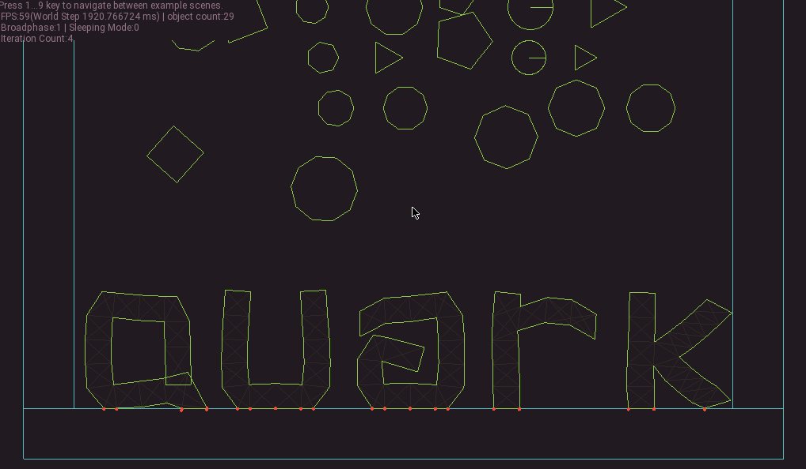
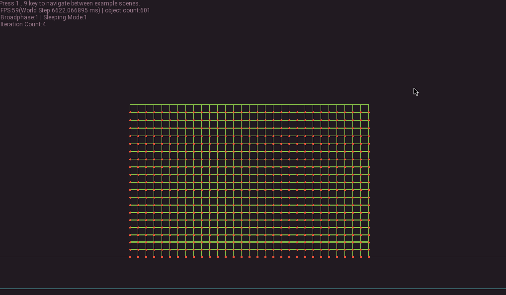

QuarkPhysics is a 2D physics engine designed for games. Its goal is to provide a reasonable approach to simulate rigid bodies, soft bodies, and different physics models together.

[Examples](http://www.github.com/quarkphysics/examples) | [API Documentation](http://) | wiki(coming soon)

**Note:** The project is in the development phase until v1.0.  

 ---
 
 

 
Show Example Scenes

 
 
 
 
 
 

## Features
* General Features
  * Privimitive shape types (circle, polygon, rectangle...etc) 
  * Physical properties (mass, area, restitution etc.)
  * The API designed specifically for 2D video games. 
  * Raycasting
  * Collision layer masks
  * SAP for broadphase
  * Supports sleeping islands to reduce the CPU performance.
  * Flexible and advanced event system.
  * It uses pixels directly as a unit, no abstraction.
  * Unlimited shape-mesh support for bodies.
  * Simple and consistent API
  * QMesh Editor app for the editing mesh features of the bodies(Coming soon) 
   
* Rigid bodies
  * Joints to connect bodies
  * Reasonable stability in stacked objects.
  * Kinematic bodies for controllable physics objects. 
  * Area bodies for dedecting and reporting collisions.

* Soft Bodies
  * Springs to connect particles.
  * Mass-spring model.
  * Area-volume preserving model.
  * Shape matching features.
  * Self particle collisions.
  * PBD dynamics.
  * Internal springs and particles.
  * Customizable constraints
  * Advanced particle methods 
  
## Building Examples
You need to install [SFML](https://www.sfml-dev.org/) and [CMake](https://cmake.org/) on your system before. 

Download project, enter the main folder and call this;

        ./build.sh
Another way is that compiling the project directly via gcc if you're on linux call; 

        ./run_linux_fast.sh -r

## Using
Copy the "QuarkPhysics" named subfolder in the main folder to your project and use it. 

## Roadmap
* 1.0
  * API revisions 
  * Optimizations
  * Bug fixes 
* 1.1
  * Auto converting a concave polygon to convex polygons 
  * Static-dynamic particles 
  * Breakable spring connections.
  * UV features to QMesh
* 1.2
   * Determinism (with fixed point method)
   * Destructable rigid bodies.
   * Continuous collision dedection (CCD)
* 1.3
    * Fluid dynamics

